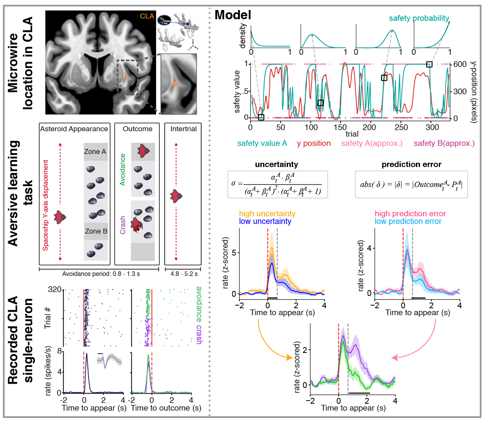

# Human claustrum neurons encode uncertainty and prediction errors during aversive learning

# Table of Contents

- [Overview](#Overview)
- [Abstract](#Abstract)  
- [Software Requirements](#Software-Requirements)
- [Directory Structure](#Directory-Structure)
- [Installation](#Installation)
- [Usage](#Usage)
- [Citation](#Citation)
- [Contributing](#Contributing)
- [License](#License)

# Overview

This repository contains code for reproducing analyses from the paper *Human claustrum neurons encode uncertainty and prediction error during aversive learning*. 

# Abstract

We recorded single-neuron activity from the human claustrum (CLA), anterior cingulate cortex (ACC), and amygdala (AMY) during aversive learning. CLA and ACC neurons showed structured, task-related responses, whereas AMY neurons were weakly modulated. CLA neurons uniquely encoded uncertainty and prediction errors, providing the first direct evidence that the claustrum supports predictive processing and coordinates distributed neural systems during adaptive behavior.



# Software Requirements

- **MATLAB 2023b** (**MathWorks, Natick, MA**) for Figures 1-3
  
  Required toolboxes:
  
  - Statistics and Machine Learning Toolbox
  
  - Signal Processing Toolbox

- **Python 3.9** for Figures 4–5

# Directory Structure

Here's an overview of the repository structure:

```
├── NeuroPair/                                       # Recurrent Graph Neural Network with Attention (Python)
├── utilities/                                       # Helper functions for MATLAB analyses
├── HumanCLAandACC_Fig1e.m                           # MATLAB script for Figure 1e
├── HumanCLAandACC_Fig1f.m                           # MATLAB script for Figure 1f
├── HumanCLAandACC_Fig1g.m                           # MATLAB script for Figure 1g
├── HumanCLAandACC_Fig1h.m                           # MATLAB script for Figure 1h
├── HumanCLAandACC_Fig1i.m                           # MATLAB script for Figure 1i
├── HumanCLAandACC_Fig1j.m                           # MATLAB script for Figure 1j
├── HumanCLAandACC_Fig2_HeatMap.m                    # MATLAB script for Figure 2 heatmap
├── HumanCLAandACC_Fig2&3_MeanResponseStats.m        # MATLAB script for Figures 2 & 3 mean responses
├── HumanCLAandACC_Fig2&3_PausersBursters_HeatmapZScoresStats.m  # MATLAB script for Figures 2 & 3 heatmap stats
├── HumanCLAandACC_Fig2&3_PermutationTest.m          # MATLAB script for Figures 2 & 3 permutation test
├── HumanCLAandACC_Fig2&3_exampleNeuron.m            # MATLAB script for Figures 2 & 3 example neuron
├── HumanCLAandACC_Fig4&5_Chord_Diagram.R            # R script for Figures 4 & 5 chord diagram
├── HumanCLAandACC_Fig4&5_Mutual_Information.py      # Python script for Figures 4 & 5 mutual information
├── HumanCLAandACC_Fig4&5_cluster_based_perm.py      # Python script for Figures 4 & 5 cluster-based permutation analysis
├── HumanCLAandACC_Fig4_histogram.py                 # Python script for Figure 4 histogram
├── HumanCLAandACC_ExtFig2_FractionOfResponders.m    # MATLAB script for Extended Figure 2 fraction of responders
├── HumanCLAandACC_ExtFig2_PercentageOfResponders.m  # MATLAB script for Extended Figure 2 percentage of responders
├── HumanCLAandACC_ExtFig2_vennDiagrams.m            # MATLAB script for Extended Figure 2 Venn diagrams
├── HumanCLAandACC_ExtFig3_Stats.m                   # MATLAB script for Extended Figure 3 stats
├── HumanCLAandACC_ExtFig4_HeatMap.m                 # MATLAB script for Extended Figure 4 heatmap
├── HumanCLAandACC_ExtFig4_HeatMap_Shuffled.m        # MATLAB script for Extended Figure 4 shuffled heatmap
├── HumanCLAandACC_ExtFig8a.py                       # Python script for Extended Figure 8a
├── HumanCLAandACC_ExtFig9a_e.py                     # Python script for Extended Figure 9a-e
└── README.md                                        
```

# Installation

Download or clone the repository

```bash
git clone https://github.com/damisahlab/claustrum-uncertainty-surprise
```

# Usage

The analysis of each figure can be regenerated from that folder using the corresponding code for each figure. 

**Example:** To generate Fig. 1e:

                *HumanCLAandACC_Fig1e*

# Citation

If you use this repository (code, figures, or analysis pipeline) in academic work, please cite:

> XX et al, "Human claustrum neurons encode uncertainty and prediction errors during aversive learning", *XX*, 2026

### BibTeX
```bibtex
@article{XX2026,
  title   = {Human claustrum neurons encode uncertainty and prediction errors during aversive learning},
  author  = {...},
  journal = {...},
  year    = {YYYY},
  doi     = {10.xxxx/xxxxx}
}

## Contributing

We welcome contributions!

## License

This project is licensed under the [MIT License](LICENSE).
